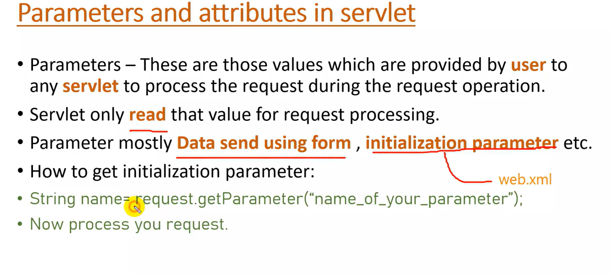

# JSP---Servlet

## DESCRIPTION

Servlet is a simple java program that runs on server and capable of handling request and generating dynamic response.

- @webServlet("/man") ne pas oublier le **/**

## INSTALLATION TOMCAT

- Download Tomcat

- Click on Windows service installer

- tout cocher

- Server Shutdown port: 8005

- HTTP: 9494

- AJP: 8009

- **username:** dpro

- **password :** kala

- Add roles: manager-script

- Acces with: localhost:9494

- Go to C:\Program Files\Apache Software Foundation

- Enter in the folder tomcat version to get the permission

### ADD TO NETBEANS

- Services > Servers , Right click > add server

- Choose Tomcat

- Go to C:\Program Files\Apache Software Foundation and select the tomcat folder

### TABLE OF CONTENT

- **JDBC**

- **Testing**

- **youtube**

- **ZTEST**

- **request dispatcher**

- **Sessions**

- **Session Login**

- **URL REWRITING**

- **HTTPSESSION**

- 

### LIFECYCLE

- **Load and Instantiate**

- **call init() method for servlet information**

- **service() method get called for processing the request**

- Attributes these are the objects that are attached by one servlet to  object(session, request ,config, context) and other servlet can fetch that object to process to logic.

- Servlet can easily **modify , add and remove** the content of attribute when required.
