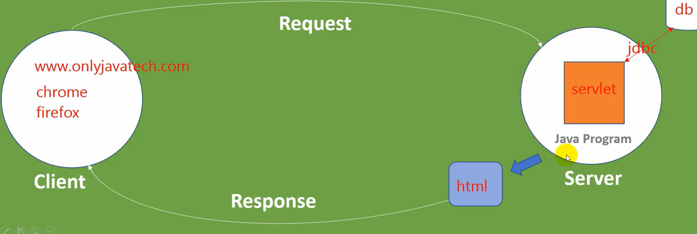
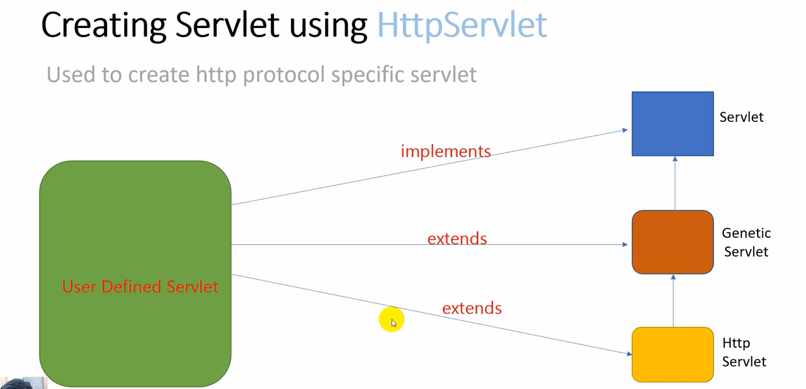
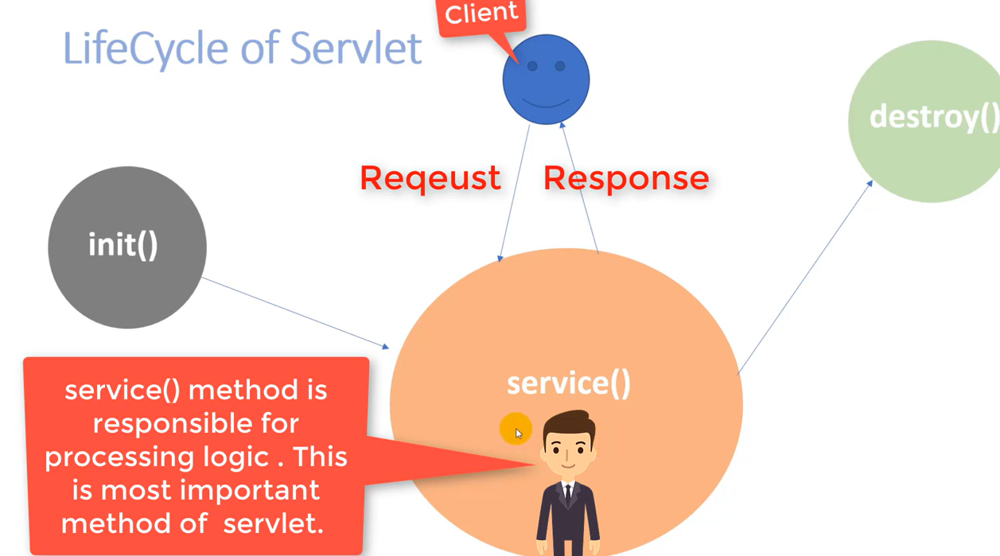

# JSP---Servlet

## DESCRIPTION

Servlet is a simple java program that runs on server and capable of handling request and generating dynamic response.

## INSTALLATION TOMCAT

- Download Tomcat

- Click on Windows service installer

- tout cocher

- Server Shutdown port: 8005

- HTTP: 9494

- AJP: 8009

- **username:** dpro

- **password :** kala

- Add roles: manager-script

- Acces with: localhost:9494

- Go to C:\Program Files\Apache Software Foundation

- Right click on Tomcat folder , Security > edit , Full controle to all users (enlever le read-only)

### ADD TO NETBEANS

- Services > Servers , Right click > add server

- Choose Tomcat

- Go to C:\Program Files\Apache Software Foundation and select the tomcat folder

### LIFECYCLE

- **Load and Instantiate**

- **call init() method for servlet information**

- **service() method get called for processing the request**
